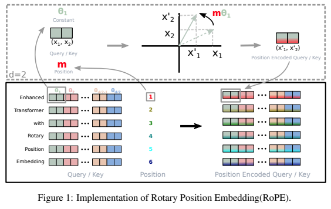

# RoPE PyTorch

  

PyTorch implementation of Rotary Position Embedding(RoPE).

[Rotary Position Embedding(RoPE)](https://arxiv.org/abs/2104.09864) - RoFormer: Enhanced Transformer with Rotary Position Embedding.
